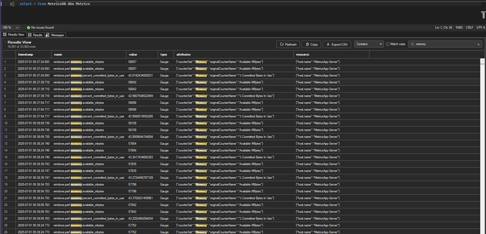

# Filterable Results Grid for SSMS 22

A VSIX extension for SQL Server Management Studio 22 that adds a filterable
grid view tightly integrated with query results. When you execute a query, it
mirrors the result set into a WPF `DataGrid` tab (next to Results/Messages
when host discovery succeeds) with a live filter box in the top right that
substring-matches across every column.





## What this does (and does not) do

SSMS's built-in results grid (`Microsoft.SqlServer.Management.UI.Grid.GridControl`)
is instantiated by internal SSMS code and is **not replaceable** through any
public VSIX seam — there is no MEF/composition hook to swap it out. Instead,
this extension adds a companion view that is injected into the native
Results/Messages tab host when possible (with a tool window fallback if SSMS
layout internals differ), and:

- Auto-refreshes after each `Query.Execute` command.
- Reads the current active grid's contents via reflection against
`GridControl.GridStorage` / `GetCellDataAsString`.
- Provides a top-right filter box with debounced live search and a row
counter (`42 of 1,337 rows`).

If Microsoft changes `GridControl`'s internal shape in a future SSMS build,
the reflection path will degrade gracefully: capture returns `null` and the
tool window stays empty rather than crashing.

## Prerequisites

- **Visual Studio 2022** (17.8 or newer) with the
*Visual Studio extension development* workload.
- **.NET Framework 4.7.2** developer pack.
- **SQL Server Management Studio 22** (for testing the installed VSIX).
SSMS 22 hosts the Visual Studio 2022 shell natively, so any VSIX built
against the 17.x `Microsoft.VisualStudio.SDK` loads in it directly.

## Build

```powershell
# From the repo root:
msbuild SsmsResultsGrid.sln /t:Restore /p:Configuration=Release
msbuild SsmsResultsGrid.sln /t:Build   /p:Configuration=Release
```

The packaged extension lands at:

```
src\SsmsResultsGrid\bin\Release\SsmsResultsGrid.vsix
```

## Install

Double-click the `.vsix` and let VSIXInstaller target **SSMS 22**. If SSMS
is not offered in the installer, drop the file here and restart SSMS:

```
%LocalAppData%\Microsoft\SQL Server Management Studio\22.0\Extensions\
```

## Use

1. Open a query window and execute any `SELECT` in SSMS.
2. A **Filter** tab appears in the query's result area (or you can open it
  manually via *Tools → Show Filterable Results Grid*).
3. Type in the filter box in the top right — the grid narrows in real time.
4. Hit **Refresh** to re-capture the current result set on demand.

## Project layout

```
src/SsmsResultsGrid/
├── FilterableGridPackage.cs           # AsyncPackage entry point
├── FilterableGridPackage.vsct         # command table (Tools menu item)
├── PackageGuids.cs
├── source.extension.vsixmanifest      # targets VS 17.x + SSMS 22
├── Commands/
│   └── ShowFilterableGridCommand.cs   # Tools-menu command
├── Services/
│   ├── QueryExecutionListener.cs      # priority command target → poll for results
│   ├── SsmsGridCaptureService.cs      # reflection against GridControl internals
│   └── InlineFilterTabService.cs      # injects/updates inline Filter tab
└── ToolWindows/
    ├── FilterableGridToolWindow.cs
    ├── FilterableGridControl.xaml     # DataGrid + top-right filter TextBox
    └── FilterableGridControl.xaml.cs  # debounced filter, row counter
```

## Known limitations

- **Multiple result sets**: only the active/topmost grid is captured.
Re-click the result tab you want, then click **Refresh**.
- **BLOB / image columns**: captured as their string representation (per
SSMS's own `GetCellDataAsString`).
- **Huge result sets**: capture is capped at 100,000 rows to keep the WPF
virtualization path responsive. Adjust `MaxRowsToCapture` in
`SsmsGridCaptureService` if you need more.
- **Results-to-text / Results-to-file modes**: there is no grid to capture;
the tool window stays empty.
- **SSMS 20 and earlier** used the VS Isolated Shell and a different VSIX
target schema. This project targets SSMS 22 only.

## License

MIT.